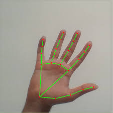

# Hand Voxels

An interactive 3D voxel builder powered by hand gestures. This project uses **MediaPipe** for hand tracking and **Three.js** for 3D rendering to create a "touchless" creative environment where you can place, manipulate, and clear voxels using your webcam.



## ✨ Features

- **Real-time Hand Tracking**: Powered by MediaPipe's Hand Landmarker.
- **Gesture-Based Interaction**:
  - **Place Voxel**: Pinch Thumb + Index finger.
  - **Rotate Space**: Pinch Thumb + Middle finger and move your hand.
  - **Zoom**: Pinch Thumb + Ring finger and move vertically.
  - **Reset View**: Close your fist.
  - **Clear All**: Open your hand and perform a fast horizontal "wipe" motion.
- **Voxel Physics & Visuals**:
  - Rounded voxels with dynamic HSL color shifts.
  - Subtle "bobbing" animations and scale-in transitions.
  - Real-time shadows and ambient lighting.
- **Hybrid Controls**: Support for mouse interaction (OrbitControls) alongside hand gestures.

## 🚀 Getting Started

### Prerequisites

- Node.js (v18 or higher recommended)
- A webcam

### Installation

1. Clone the repository:
   ```bash
   git clone <repository-url>
   cd hand-voxels
   ```

2. Install dependencies:
   ```bash
   npm install
   ```

3. Start the development server:
   ```bash
   npm run dev
   ```

4. Open your browser to the URL shown in the terminal (usually `http://localhost:5173`).

## 🎮 How to Use

Allow camera access when prompted. Once your hand is detected, you will see a skeleton overlay.

| Action | Gesture |
| :--- | :--- |
| **Place Voxel** | Pinch **Thumb + Index** |
| **Rotate Space** | Pinch **Thumb + Middle** |
| **Zoom In/Out** | Pinch **Thumb + Ring** |
| **Reset View** | **Closed Fist** |
| **Clear All** | **Open Hand + Fast Wipe** |
| **Alternative Clear**| Press **'C'** on keyboard |

## 🛠️ Tech Stack

- **[Vite](https://vitejs.dev/)**: Next Generation Frontend Tooling.
- **[Three.js](https://threejs.org/)**: A JavaScript 3D library.
- **[MediaPipe Tasks Vision](https://developers.google.com/mediapipe/solutions/vision/hand_landmarker)**: On-device machine learning for hand tracking.

## 📝 License

This project is open source and available under the MIT License.
